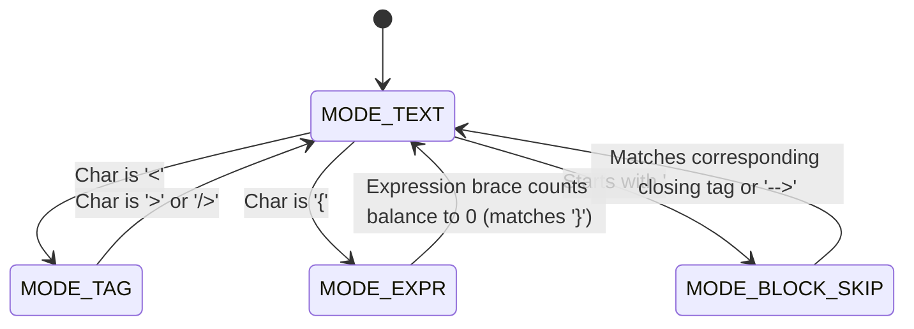

# Phase 4: Hardcoded String Detection — Research

**Researched:** 2026-05-30
**Domain:** Scanner & Template Parser core, Validation Orchestrator, CLI & Markdown reporting
**Confidence:** HIGH — State Machine parsing strategy fits perfectly with the project's zero-dependency constraint and existing helpers.

---

<user_constraints>
## User Constraints (from CONTEXT.md)

### Locked Decisions
- **D-01**: Implement a custom lightweight State Machine template parser in `src/core/scanner/hardcoded.ts` without introducing external AST/HTML parsers.
- **D-02**: Detect hardcoded strings in text nodes, text-heavy attributes, and simple JSX expression literals.
- **D-03**: Report findings with path, line number (calculated via `offsetToLine` from Phase 2), and the raw text snippet.
- **D-04**: Support ignore rules in `hardcoded.ignore` config option (numbers, punctuation, and custom regex strings).
- **D-05**: Cause `validate` to fail (exit code 1) when `--check-hardcoded` is set and hardcoded strings are found.
- **D-06**: Include a "Hardcoded strings" section in the markdown validation report.
</user_constraints>

---

## Technical Feasibility & Strategy

### 1. File Filtering & Scope
- We will reuse `getFiles` and the existing config parsing from `src/core/scanner/files.ts`.
- The scanner will only inspect files with extensions in `.tsx`, `.jsx`, `.vue`, `.svelte`, `.astro`.
- Other scanned files (like `.ts` or `.js` files containing no template markup) are skipped for hardcoded string checks.

### 2. Custom State Machine Parser
To find text nodes, attributes, and expression literals without a heavy HTML compiler, we can implement a char-by-char scanner on source code (after stripping comments).

We define 4 parsing modes:
1. `MODE_TEXT` (Default): Reading text nodes.
2. `MODE_TAG`: Inside `<...>` tags.
3. `MODE_EXPR`: Inside `{...}` expressions (JSX/Svelte/Astro) or `{{...}}` expressions (Vue).
4. `MODE_BLOCK_SKIP`: Inside `<script>` or `<style>` blocks (Vue/Svelte/Astro) or comments.

#### Transition Diagram


#### Char-by-char Scan Details & Enhancements:

- **`MODE_TEXT`**:
  - Accumulate characters into `currentText`.
  - On `<`:
    - Check if it starts a tag to skip: `<!--` (HTML comment), `<script`, `<style`, `<code>`, `<pre>`, `<svg>`, `<path>`, `<noscript>`, `<iframe>`, `<svelte:head>`. If so, push to `MODE_BLOCK_SKIP` with target closing token (`-->`, `</script>`, `</style>`, `</code>`, `</pre>`, `</svg>`, `</path>`, `</noscript>`, `</iframe>`, `</svelte:head>`).
    - Otherwise, flush `currentText` as a text node candidate (with its source offset) and transition to `MODE_TAG`. Reset `currentText`.
  - On `{` (or `{{`):
    - Flush `currentText`. Transition to `MODE_EXPR` with `braceDepth = 1`. Reset `currentText`.

- **`MODE_TAG`**:
  - Accumulate characters inside `currentTagContent`.
  - On `>` or self-closing `/>`:
    - **Extract Attributes**: Parse `currentTagContent` for text-heavy attributes: `placeholder`, `label`, `title`, `alt`, `aria-label`.
    - Attribute regex: `(?:placeholder|label|title|alt|aria-label)\s*=\s*(?:"([^"]*)"|'([^']*)')`
    - Check matches: If static values are found (not referencing braces or template variables), flush them as candidates with their approximate tag offset.
    - Transition back to `MODE_TEXT`. Reset `currentTagContent`.

- **`MODE_EXPR`**:
  - Accumulate characters inside `currentExprContent`.
  - On `{`: Increment `braceDepth`.
  - On `}`: Decrement `braceDepth`.
  - When `braceDepth === 0`:
    - **Extract JSX String Literals**: Trim `currentExprContent`. Check if it matches a simple quoted string literal:
      - Regex: `/^["'`]([^"'`]+)["'`]$/`
      - If it matches and the inner content has no nested braces/variables, flush the inner string as a hardcoded candidate.
    - Transition back to `MODE_TEXT`. Reset `currentExprContent`.

- **`MODE_BLOCK_SKIP`**:
  - Wait for target closing token. Once found, transition back to `MODE_TEXT`.

### 3. Ignoring False Positives (Ignore Logic)
Once a raw text/attribute/expression candidate is flushed:
1. Trim whitespace: `const text = candidate.trim()`. Skip if empty.
2. Filter out:
   - **Punctuation-only**: Matches regex `/^[!@#$%^&*()_+={}\[\]|\\:;"'<>,.?/~` \-—–••…&bull;&nbsp;&middot;]+$/`.
   - **Numbers-only**: Matches regex `/^[0-9\s.,%\-]+$/`.
   - **Custom Ignores**: Match against `hardcoded.ignore` config patterns (can be literal strings or regex patterns).
   - *Note: No automatic acronym ignoring by default to prevent missing UI text like "OK".*

### 4. Integration into validate.ts & Reporting
- Modify `validate()` in `src/commands/validate.ts`. If `options.checkHardcoded` is set:
  - Run the hardcoded template scanner across all eligible source files.
  - Collect `HardcodedFinding[]` arrays.
  - Print grouped reports in terminal outputs.
  - If findings exist, mark validation as failed (affects CLI exit code).
- Modify `renderMarkdownReport` in `src/commands/validate/report.ts` to output:
  ```markdown
  ## Hardcoded Strings
  
  | File | Line | Snippet |
  |------|------|---------|
  | src/App.tsx | 24 | `Un-translated Text` |
  ```
- Update zod schema in `src/config/schema.ts` to accept `hardcoded?: { ignore?: string[] }`.

---

## Codebase Surface & Planned Changes

| File | Role | Modifying / Creating |
|------|------|----------------------|
| `src/core/scanner/hardcoded.ts` | Custom state machine scanner core | **[NEW]** |
| `src/types.ts` | Extend `ValidationResults`, etc. | **[MODIFY]** |
| `src/config/schema.ts` | Extend schema with `hardcoded.ignore` | **[MODIFY]** |
| `src/commands/validate.ts` | Wire check, collect findings, fail on error | **[MODIFY]** |
| `src/commands/validate/output.ts` | Output findings as formatted terminal tables | **[MODIFY]** |
| `src/commands/validate/report.ts` | Add hardcoded strings table to Markdown report | **[MODIFY]** |
| `src/cli.ts` | Register `--check-hardcoded` flag on `validate` | **[MODIFY]** |
| `src/__tests__/hardcoded.test.ts` | Unit tests for parser and ignores (fast-check property tests) | **[NEW]** |
| `src/__tests__/validate.test.ts` | Integration tests for exit code and Markdown output | **[MODIFY]** |
