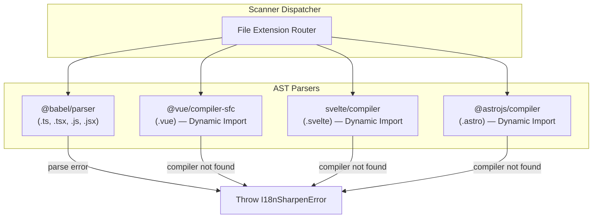

# Implementation Plan — AST-based Parsers (v0.4.0)

Nâng cấp toàn bộ bộ quét (scanner) từ Regex/State Machine sang AST Parser chính thức cho từng framework, đảm bảo key extraction, dynamic key classification, và hardcoded string detection đạt **độ chính xác 100%**.

---

## User Review Required

> [!IMPORTANT]
> **Breaking Change: Public API chuyển sang Async**
> Hàm `validate()` hiện tại là **synchronous**. Vì việc dynamic import compiler của Vue/Svelte/Astro bắt buộc phải dùng `await import(...)`, hàm `validate()` sẽ phải chuyển thành `async`. Đây là breaking change cho người dùng programmatic API.
> 
> Chúng ta cần bump **semver minor** (vì project < 1.0.0) lên `0.4.0`.

> [!WARNING]  
> **Bundle Size tăng đáng kể**
> - Hiện tại: 4 deps nhẹ (~50KB total).
> - Sau khi thêm: `@babel/parser` (~1.8MB) + `@babel/traverse` (~400KB, kéo theo `@babel/types` ~2.5MB).
> - **Tổng cộng thêm ~4.7MB** vào dependency tree.
> - Đây là trade-off cần chấp nhận để đạt 100% accuracy. Lượng data này không ảnh hưởng performance runtime (chỉ tải 1 lần khi khởi động CLI).

---

## Nguyên tắc thiết kế: Strict Fail-Fast

> [!CAUTION]
> **Không có fallback.** Nếu AST parser gặp lỗi cú pháp → **throw error** kèm tên file và dòng lỗi cụ thể, để user biết chính xác cần sửa file nào. Nếu compiler framework không tìm thấy trong `node_modules` của user → **throw error** kèm hướng dẫn cài đặt rõ ràng (ví dụ: `"To scan .vue files, install @vue/compiler-sfc: pnpm add -D @vue/compiler-sfc"`).
>
> Toàn bộ code regex scanner cũ (`regex.ts`, `hardcoded.ts`, `dynamic.ts`) sẽ bị **xóa hoàn toàn** sau khi AST parsers hoàn thành.

---

## Kiến trúc tổng quan



### Dependencies Strategy
1. **Direct Dependencies** (thêm vào `package.json#dependencies`):
   - `@babel/parser`: Parse JS/TS/JSX/TSX thành Babel AST.
   - `@babel/traverse`: Duyệt cây AST để tìm call expressions, JSX attributes, text nodes.

2. **Dynamic Resolution** (không thêm vào dependencies):
   - `@vue/compiler-sfc` + `@vue/compiler-dom`: Load từ `node_modules` của user.
   - `svelte/compiler`: Load từ `node_modules` của user.
   - `@astrojs/compiler`: Load từ `node_modules` của user.
   - Nếu compiler không tồn tại → **throw `I18nSharpenError`** kèm hướng dẫn cài đặt cụ thể.

---

## Proposed Changes

### Phase 1: Hạ tầng & Interface

#### [MODIFY] `package.json`
Thêm Babel dependencies và bump version:
```diff
- "version": "0.3.0",
+ "version": "0.4.0",
  "dependencies": {
+   "@babel/parser": "^7.27.0",
+   "@babel/traverse": "^7.27.0",
    "commander": "^12.1.0",
```

#### [NEW] `src/core/scanner/parsers/types.ts`
Định nghĩa interface thống nhất cho output của tất cả parser:
```typescript
export interface ParsedFileResult {
  /** Static translation keys found: t("key"), i18nKey="key" */
  usedKeys: { key: string; offset: number }[]
  /** Dynamic/non-static calls: t(variable), t("prefix." + x) */
  dynamicCalls: { expression: string; arg: string; offset: number }[]
  /** Hardcoded text candidates: <div>Hello</div>, placeholder="Enter name" */
  hardcodedCandidates: { text: string; offset: number }[]
}
```

#### [NEW] `src/core/scanner/parsers/resolve.ts`
Helper dynamic loader, dùng `createRequire` từ cwd của user:
```typescript
export async function loadWorkspaceDep<T>(name: string, cwd: string): Promise<T>
```
- **Throw `I18nSharpenError`** nếu package không tìm thấy, kèm message hướng dẫn cài đặt cụ thể.
- Ví dụ: `"Cannot scan .vue files: package '@vue/compiler-sfc' not found. Run: pnpm add -D @vue/compiler-sfc"`.

---

### Phase 2: AST Parsers

#### [NEW] `src/core/scanner/parsers/babel.ts`
Parser chính cho `.ts`, `.tsx`, `.js`, `.jsx` sử dụng `@babel/parser` + `@babel/traverse`.

**Trích xuất 3 loại data cùng lúc trong 1 lần duyệt cây:**
1. **Used Keys:** Visitor `CallExpression` khớp `matchFunctions` → trích xuất static string argument.
2. **Dynamic Calls:** Visitor `CallExpression` khớp `matchFunctions` nhưng argument không phải static string → thu thập raw expression.
3. **Hardcoded Candidates:** Visitor `JSXText` (text nodes) + `JSXAttribute` với giá trị `StringLiteral` (cho `placeholder`, `title`, `alt`, `aria-label`, `label`).

**Parser config:**
```typescript
import { parse } from "@babel/parser"
const ast = parse(source, {
  sourceType: "module",
  plugins: ["jsx", "typescript", "decorators-legacy"],
  errorRecovery: true  // Không crash khi gặp syntax error nhỏ
})
```

> [!TIP]
> `errorRecovery: true` cho phép Babel vẫn parse được phần lớn file dù có 1-2 dòng lỗi cú pháp. Nếu file có lỗi cú pháp nghiêm trọng không thể phục hồi → throw `I18nSharpenError` kèm tên file và chi tiết lỗi.

#### [NEW] `src/core/scanner/parsers/vue.ts`
1. Dynamic load `@vue/compiler-sfc` → gọi `parse(source)` → tách ra `descriptor.template` và `descriptor.scriptSetup` / `descriptor.script`.
2. **Template block:** Dynamic load `@vue/compiler-dom` → gọi `compile(template.content)` → duyệt AST tìm text nodes và static attributes.
3. **Script block:** Chuyển `script.content` sang `babel.ts` parser (reuse logic).

#### [NEW] `src/core/scanner/parsers/svelte.ts`
1. Dynamic load `svelte/compiler` → gọi `parse(source)`.
2. Duyệt `ast.html` tree tìm `Text` nodes và element attributes.
3. Trích xuất `ast.instance.content` (script block) → chuyển sang `babel.ts`.

#### [NEW] `src/core/scanner/parsers/astro.ts`
1. Dynamic load `@astrojs/compiler` → gọi `parse(source)`.
2. Tách Frontmatter script và HTML body.
3. Frontmatter → chuyển sang `babel.ts`. HTML body → duyệt tìm text nodes.

---

### Phase 3: Dispatcher & Integration

#### [NEW] `src/core/scanner/parsers/index.ts`
Scanner dispatcher trung tâm:
```typescript
export async function parseFile(
  filePath: string,
  content: string,
  config: ScannerConfig,
  cwd: string
): Promise<ParsedFileResult>
```
- Route theo file extension: `.tsx/.jsx/.ts/.js` → `babel.ts`, `.vue` → `vue.ts`, v.v.
- Nếu AST parser throw → propagate error lên caller. Không fallback.

#### [MODIFY] `src/core/scanner/index.ts`
Refactor `detectUsedKeys` thành **async** và sử dụng `parseFile` dispatcher thay vì regex:
```diff
- export function detectUsedKeys(
+ export async function detectUsedKeys(
    files: string[],
    matchFunctions: string[],
-   matchAttributes: string[]
- ): { usedKeys: Set<string>; fileContents: string[] } {
+   matchAttributes: string[],
+   cwd: string
+ ): Promise<{ usedKeys: Set<string>; fileContents: string[]; parsedResults: Map<string, ParsedFileResult> }> {
```

> [!IMPORTANT]
> **`fileContents` vẫn phải trả về** dù chuyển sang AST. Tính năng `looseKeyMatch` trong `validate.ts` (L192-L213) dùng `fileContents` (stripped comments) để search `"key"` bằng `String.includes()`. Hàm `stripComments` vẫn phải chạy trên raw content trước khi truyền vào `looseKeyMatch`.

#### [MODIFY] `src/commands/validate.ts`
Chuyển `validate()` sang **async**:
```diff
- export function validate(
+ export async function validate(
    config: I18nSharpenConfig,
    cwd: string = process.cwd(),
    options?: { checkHardcoded?: boolean }
- ): ValidationResults {
+ ): Promise<ValidationResults> {
```

Tái cấu trúc vòng lặp quét file: thay vì chạy 3 regex riêng biệt (`keyRegex`, `dynamicCallRegex`, `scanTemplateTextNodes`) trên mỗi file, giờ chỉ cần gọi `parseFile()` **một lần duy nhất** và nhận về cả 3 loại data.

#### [MODIFY] `src/commands/extract.ts`
Chuyển `extract()` sang **async** — file này gọi `detectUsedKeys()` tại L40.

#### [MODIFY] `src/commands/prune.ts`
Chuyển `prune()` sang **async** — file này gọi `detectUsedKeys()` tại L61.

#### [MODIFY] `src/index.ts` (Public API)
Cập nhật export — `validate`, `extract`, `prune` giờ đều trả về `Promise`. Đây là breaking change cho toàn bộ programmatic API.

#### [MODIFY] `src/cli.ts`
Wrap `validate()`, `extract()`, `prune()` trong CLI action handlers với `await`.

---

### Phase 4: Xóa code cũ (Regex/State Machine) & Dọn dẹp

#### [DELETE] `src/core/scanner/regex.ts`
Xóa hoàn toàn `buildKeyRegex`, `buildAttrRegex`, `buildDynamicCallRegex`, `escapeRegex`. Thay thế bởi Babel AST traversal.

#### [DELETE] `src/core/scanner/hardcoded.ts`
Di chuyển `isHardcodedIgnored` sang `text.ts`, sau đó xóa file.

#### [DELETE] `src/core/scanner/dynamic.ts`
Xóa hoàn toàn `classifyDynamicCall`, `extractLeadingPrefix`, `DynamicClassification`. Thay thế bởi Babel AST visitor.

#### [DELETE] `src/core/scanner.ts`
Đây là deprecated shim (`export * from "./scanner/index"`). Xóa file, cập nhật bất kỳ importer nào sang import trực tiếp `@/core/scanner`.

#### [MODIFY] `src/utils.ts`
File này có deprecated re-exports của 7 scanner symbols (`escapeRegex`, `stripComments`, `isStaticStringLiteral`, `getBaseKey`, `isKeyUsed`, `matchWildcard`, `getFiles`). Xóa `escapeRegex` (bị xóa cùng regex.ts), cập nhật import paths cho các symbol còn lại.

#### [KEEP] `src/core/scanner/text.ts`
- `stripComments` — **vẫn cần** cho `looseKeyMatch` feature (search key trong stripped content).
- `isStaticStringLiteral` — **trở nên redundant** cho dynamic key detection (AST kiểm tra node type trực tiếp), nhưng giữ lại vì có thể cần cho edge cases hoặc API consumers.
- `getBaseKey`, `matchWildcard`, `isKeyUsed` — vẫn cần thiết, không bị ảnh hưởng.
- Thêm `isHardcodedIgnored` (di chuyển từ hardcoded.ts).

#### [KEEP] `src/core/scanner/lines.ts`
Giữ nguyên `computeLineOffsets`, `offsetToLine` — vẫn cần cho việc tính toán số dòng từ offset của AST nodes.

#### [KEEP] `src/core/scanner/files.ts`
Giữ nguyên `getFiles`, `scanSourceFiles` — vẫn cần cho việc quét thư mục tìm file nguồn.

#### [MODIFY] `src/core/scanner/index.ts`
Viết lại barrel exports: xóa re-export từ `regex`, `hardcoded`, `dynamic`. Thêm re-export từ `parsers/`. Refactor `detectUsedKeys` sang async sử dụng AST dispatcher.

---

## File tổng quan các thay đổi

| File | Action | Mô tả |
|:---|:---|:---|
| `package.json` | MODIFY | Thêm `@babel/parser`, `@babel/traverse`, bump `0.4.0` |
| `src/core/scanner/parsers/types.ts` | NEW | Interface `ParsedFileResult` |
| `src/core/scanner/parsers/resolve.ts` | NEW | Dynamic dependency loader (strict throw) |
| `src/core/scanner/parsers/babel.ts` | NEW | Babel AST parser cho JS/TS/JSX/TSX |
| `src/core/scanner/parsers/vue.ts` | NEW | Vue SFC parser |
| `src/core/scanner/parsers/svelte.ts` | NEW | Svelte compiler parser |
| `src/core/scanner/parsers/astro.ts` | NEW | Astro compiler parser |
| `src/core/scanner/parsers/index.ts` | NEW | Dispatcher router (strict, no fallback) |
| `src/core/scanner/index.ts` | MODIFY | Viết lại barrel + `detectUsedKeys` → async |
| `src/commands/validate.ts` | MODIFY | `validate()` → async, dùng AST dispatcher |
| `src/commands/extract.ts` | MODIFY | `extract()` → async |
| `src/commands/prune.ts` | MODIFY | `prune()` → async |
| `src/index.ts` | MODIFY | Public API: 3 commands đều trả về Promise |
| `src/cli.ts` | MODIFY | Wrap tất cả command actions với `await` |
| `src/utils.ts` | MODIFY | Xóa `escapeRegex` re-export, cập nhật imports |
| `src/core/scanner/regex.ts` | DELETE | Thay thế bởi Babel AST |
| `src/core/scanner/hardcoded.ts` | DELETE | Di chuyển `isHardcodedIgnored` → xóa file |
| `src/core/scanner/dynamic.ts` | DELETE | Thay thế bởi Babel AST visitor |
| `src/core/scanner.ts` | DELETE | Deprecated shim, không còn cần thiết |
| `src/core/scanner/text.ts` | KEEP | Utility functions + nhận `isHardcodedIgnored` |
| `src/core/scanner/lines.ts` | KEEP | Line offset utilities |
| `src/core/scanner/files.ts` | KEEP | File scanning utilities |

---

## Verification Plan

### Automated Tests
```bash
pnpm install
pnpm typecheck
pnpm lint
pnpm test
pnpm build
```

### Test files bị ảnh hưởng

| Test File | Action | Lý do |
|:---|:---|:---|
| `src/core/scanner.test.ts` | DELETE | Tests cho `buildKeyRegex`, `buildAttrRegex`, `detectUsedKeys` (regex-based), `stripComments`, `isStaticStringLiteral` — phần lớn bị thay thế |
| `src/__tests__/dynamic.test.ts` | DELETE | Toàn bộ test `classifyDynamicCall`, `extractLeadingPrefix` bị xóa |
| `src/__tests__/hardcoded.test.ts` | DELETE | Toàn bộ test `scanTemplateTextNodes`, `isHardcodedIgnored` bị xóa |
| `src/__tests__/core.test.ts` | MODIFY | Cập nhật: giữ tests cho `stripComments`, `matchWildcard` (vẫn tồn tại trong text.ts) |
| `src/__tests__/lines.test.ts` | KEEP | Tests cho `computeLineOffsets`, `offsetToLine` — không thay đổi |
| `src/__tests__/validate.test.ts` | MODIFY | Cập nhật: `validate()` giờ là async |
| `src/__tests__/extract.test.ts` | MODIFY | Cập nhật: `extract()` giờ là async |
| `src/__tests__/prune.test.ts` | MODIFY | Cập nhật: `prune()` giờ là async |

### Checklist
- Thêm unit tests cho mỗi AST parser trong `src/__tests__/parsers/`.
- Thêm integration test kiểm tra **strict error throwing** (khi compiler không tồn tại, khi file có syntax error nghiêm trọng).
- Thêm test cho `isHardcodedIgnored` sau khi di chuyển sang `text.ts`.
- Kiểm tra kỹ Public API async migration không gây lỗi type cho caller.
