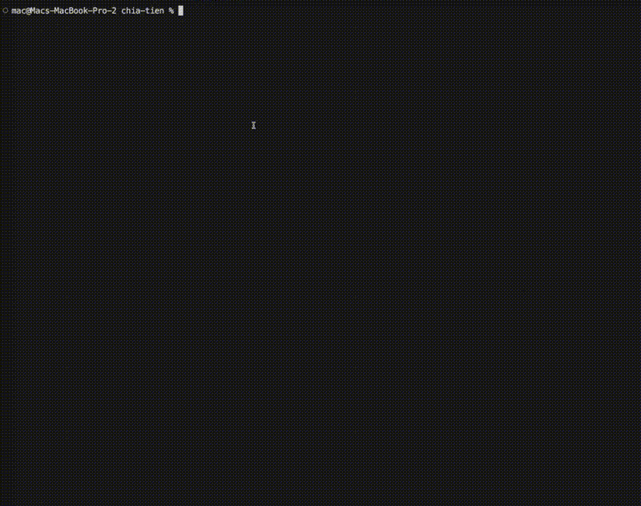
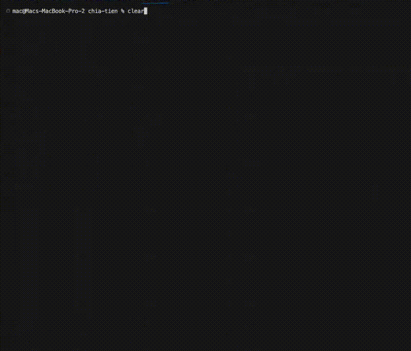
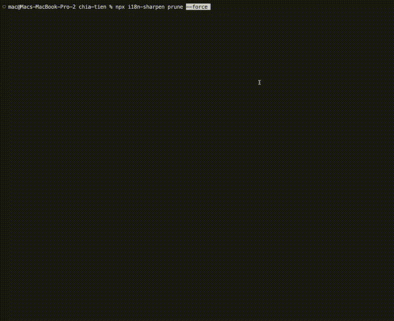

<div align="center">

<picture>
  <source media="(prefers-color-scheme: dark)" srcset="https://raw.githubusercontent.com/Schalkez/i18n-sharpen/master/assets/logo/logo-dark.svg">
  <source media="(prefers-color-scheme: light)" srcset="https://raw.githubusercontent.com/Schalkez/i18n-sharpen/master/assets/logo/logo-dark.svg">
  
</picture>

<p>
  <strong>AST-based i18n linting</strong> — missing keys, unused keys, dynamic patterns &amp; hardcoded strings<br>
  across <strong>TS&nbsp;·&nbsp;JS&nbsp;·&nbsp;Vue&nbsp;·&nbsp;Svelte&nbsp;·&nbsp;Astro</strong>.
</p>

[](https://www.npmjs.com/package/i18n-sharpen)
[](https://www.npmjs.com/package/i18n-sharpen)
[](https://bundlephobia.com/package/i18n-sharpen)
[](https://www.typescriptlang.org/)
[](https://github.com/Schalkez/i18n-sharpen/actions/workflows/ci.yml)
[](https://opensource.org/licenses/MIT)
[](http://makeapullrequest.com)
[](https://github.com/prettier/prettier)

</div>

<div align="center">
  
</div>

A **static analysis engine for localization** — not just a JSON checker. Uses real per-framework AST parsers to find missing keys, unused keys, dynamic key patterns, and hardcoded strings across **TS, JS, Vue, Svelte, and Astro** codebases.

📖 **[Read the Official Documentation](https://i18n-sharpen-docs.pages.dev)**
Keep your locale files clean, synchronized, and type-safe — with the accuracy of a compiler, not a grep.

---

## Table of Contents

- [Key Features](#key-features)
- [Installation](#installation)
- [Configuration](#configuration)
  - [Config Options](#config-options)
- [CLI Usage](#cli-usage)
- [Supported File Formats](#supported-file-formats)
- [Locale Layouts](#locale-layouts)
- [Framework Coverage](#framework-coverage)
- [Programmatic API](#programmatic-api)
- [Migration Guides](#migration-to-040)
- [CLI Exit Codes](#cli-exit-codes)
- [GitHub Actions CI Integration](#github-actions-ci-integration)
- [Why i18n-sharpen?](#why-i18n-sharpen)
- [Contributing](#contributing)
- [License](#license)

---

## Key Features

1.  **Strict Quality Validation (`validate`)**:
    *   Detects missing translation keys used in source code.
    *   **Active Placeholder Detection**: Catches keys whose value is equal to their dot-notation path (meaning they are still untranslated placeholders).
    *   **Cross-Locale Key Alignment**: Ensures that all translation JSON files have the exact same keys as the default language file.
2.  **Automatic Key Extraction (`extract`)**:
    *   Scans codebase for translation patterns and automatically appends missing keys to all JSON files while maintaining formatting.
3.  **Safe Key Pruning (`prune`)**:
    *   Detects unused keys in JSON files and safely removes them to reduce bundle size.
4.  **CI/CD Markdown Reports**:
    *   Generates a clean quality and coverage report (`i18n-coverage.md`) ideal for PR comments and CI dashboards.
5.  **Programmatic API**:
    *   Can be imported and run dynamically in Node.js scripts.

---

## Installation

Install as a devDependency using your package manager:

```bash
pnpm add -D i18n-sharpen
# or
npm install -D i18n-sharpen
# or
yarn add -D i18n-sharpen
```

```bash
# Optional: install the compiler for the frameworks you scan
pnpm add -D typescript          # .ts/.tsx/.js/.jsx scanning
pnpm add -D @vue/compiler-sfc   # .vue scanning
pnpm add -D svelte              # .svelte scanning
pnpm add -D @astrojs/compiler   # .astro scanning
```

### Zero-Cost Framework Support

`i18n-sharpen` uses an **Optional Peer Dependencies** architecture. Out of the box, the package is extremely lightweight (~720 kB) and requires zero configuration.
It dynamically lazy-loads the compiler for your framework only when it encounters that file type.

- If you use React/TypeScript, you already have `typescript` installed. `i18n-sharpen` will use it directly.
- It will **not** force you to download Vue or Svelte compilers unless you actually have `.vue` or `.svelte` files in your project.

---

## Configuration

Create an `i18n-sharpen.json` file in the root of your project:

```json
{
  "scanDirs": ["src", "packages/shared/src"],
  "localesDir": "src/locales",
  "defaultLanguage": "en",
  "supportedLanguages": ["en", "ja", "vi"],
  "matchFunctions": ["t", "getTranslation"],
  "outputReport": "i18n-coverage.md"
}
```

Alternatively, you can add an `"i18nSharpen"` field to your `package.json`:

```json
{
  "name": "my-app",
  "i18nSharpen": {
    "scanDirs": ["src"],
    "localesDir": "src/locales",
    "defaultLanguage": "en",
    "supportedLanguages": ["en", "ja"]
  }
}
```

### Config Options

| Option | Type | Default | Description |
| :--- | :--- | :--- | :--- |
| `scanDirs` | `string[]` | `["src"]` | Folders to scan for translation keys. |
| `localesDir` | `string` | `"src/locales"` | Directory containing your locale `.json` files. |
| `defaultLanguage` | `string` | `"en"` | The default/fallback locale language. |
| `supportedLanguages` | `string[]` | `["en"]` | List of supported languages. |
| `excludeDirs` | `string[]` | `["node_modules", ...]` | Directories to ignore during source scan. |
| `fileExtensions` | `string[]` | `[".ts", ".tsx", ...]` | File extensions to scan. |
| `matchFunctions` | `string[]` | `["t", "getTranslation"]` | Function names used for translation in code. |
| `matchAttributes` | `string[]` | `["i18nKey", "id", ...]` | HTML/JSX/Vue/Astro attribute names that carry translation keys. |
| `outputReport` | `string \| null` | `"i18n-coverage.md"` | Path to save quality report (`""` to disable). |
| `localesLayout` | `"flat" \| "namespaced"` | `"flat"` | Locale file layout — see [Locale Layouts](#locale-layouts). |
| `defaultNamespace` | `string` | `"common"` | Namespace used for keys without a prefix when `localesLayout === "namespaced"`. |
| `prune.force` | `boolean` | `false` | Make `prune` write by default. CLI `--force` overrides per invocation. |
| `prune.cleanEmpty` | `boolean` | `false` | Delete empty namespace files after pruning (namespaced layout only). |
| `looseKeyMatch` | `boolean` | `false` | Opt-in fuzzy match: any quoted occurrence of a locale key counts as "used". |
| `ignoreKeys` | `string[]` | `[]` | Key patterns (supports wildcards like `status.*`) to ignore during checks and pruning. |
| `pluralSuffixes` | `string[]` | `["_zero", "_one", ...]` | Custom suffixes used for plural keys (which are automatically resolved). |
| `sortKeys` | `"alpha" \| "source" \| "preserve"` | `"preserve"` | Key ordering on `extract`/`prune` writes. `alpha` = alphabetical, `source` = order first seen in source, `preserve` = keep existing order. |
| `ignoreDynamicKeys` | `string[]` | `[]` | Suppress dynamic-key warnings for patterns matching these prefixes (e.g. `["status.*", "error.*"]`). |
| `hardcoded.attributes` | `string[]` | `["placeholder","label","title","alt","aria-label"]` | HTML/JSX attributes scanned for un-translated text when using `--check-hardcoded`. Override to add framework-specific attrs. |
| `hardcoded.ignore` | `string[]` | `[]` | Strings to suppress from hardcoded-string findings (exact match or pattern). |

---

## CLI Usage

Run commands with `npx` or configure scripts in `package.json`:

```bash
# Validate translation keys and alignment
npx i18n-sharpen validate

# Extract new keys from code into json files
npx i18n-sharpen extract

# Prune unused keys from json files
npx i18n-sharpen prune
```

### Options

*   `-c, --config <path>`: Specify a custom path to your configuration file.
*   `-d, --cwd <path>`: Set custom working directory (defaults to `process.cwd()`).

`validate` accepts an additional flag:

*   `--check-hardcoded`: Scan for un-translated hardcoded strings in HTML/JSX attributes and text nodes (e.g. `placeholder="Submit"` instead of `placeholder={t("form.submit")}`). Exits with code `1` in CI when findings are present.

`extract` accepts an additional flag:

*   `--sort <mode>`: Override key sorting mode (`alpha`, `source`, `preserve`).

`prune` accepts five additional flags:

*   `--dry-run`: Preview only — never write. The default behavior; the flag exists for explicit CI scripts.
*   `--force`: Actually write the pruned locale files to disk.
*   `--interactive`: Pick which unused keys to prune via an arrow-key TUI (interactive selection).
*   `--clean-empty`: Delete namespace files that have zero keys after pruning (namespaced layout only).
*   `--sort <mode>`: Override key sorting mode (`alpha`, `source`, `preserve`).

#### Interactive TUI Pruner

Running `npx i18n-sharpen prune --interactive` (or simply `npx i18n-sharpen prune` which defaults to interactive) opens a clean command-line TUI to check/uncheck keys:

<div align="center">
  
</div>

#### Direct Pruning with Force Flag

Running `npx i18n-sharpen prune --force` directly removes all unused keys without confirmation:

<div align="center">
  
</div>

#### Verification of Pruned Keys

After running the prune command, your translation files (e.g., JSON/YAML) will have all unused keys removed. You can see the clean deletions in your Git diff (e.g., in VSCode):

<div align="center">
  
</div>

```bash
npx i18n-sharpen validate --config configs/i18n.json --cwd ./packages/app
npx i18n-sharpen validate --check-hardcoded
npx i18n-sharpen prune --force
```


### Markdown Quality Report Preview

When running `validate` in CI, the markdown report generated at `i18n-coverage.md` (or your configured path) looks like this:

```markdown
# i18n Quality and Coverage Report

Generated on: 2026-06-05T09:14:40.015Z

## Quality Metrics Summary

| Metric | Value | Status |
| :--- | :--- | :--- |
| **Code Translation Coverage** | 100.00% | 🟢 100% Perfect |
| **Locales Key Utilization** | 79.80% | 🟡 Medium |
| **Total Defined Keys** | 698 | - |
| **Actually Used Keys** | 557 | - |
| **Missing Keys** | 0 | 🟢 Clean |
| **Active Placeholders** | 0 | 🟢 Clean |
| **Unused Keys** | 141 | 🟡 Can be pruned |
| **Locale Alignment** | Align'd | 🟢 Perfect |
| **Dynamic Keys** | fully-dynamic: 1, structured-concat: 12 | 🟡 Review |

## ✅ Missing Keys

No missing translation keys detected in the source code.

## ✅ Active Placeholders

No active placeholder keys detected in the source code.

## ⚠️ Unused Keys (141)

These keys are defined in the locale file but are not used anywhere in the source code. They can be safely pruned to reduce bundle size:

- `analytics.summary`
- `analytics.year`
- `bottom_panel.details`
- `calculator.guest_mode`
- `collab.connected`
- *(136 more keys)...*

## ⚙️ Dynamic Keys

### Fully-dynamic keys (1)

| File | Line | Expression |
| :--- | :--- | :--- |
| `src/components/organisms/PaywallModal/PaywallModal.view.tsx` | 82 | `t(benefit.key)` |

### Structured-concat keys (12)

| Prefix | File | Line | Expression |
| :--- | :--- | :--- | :--- |
| `modal.split_mode.` | `src/components/.../SplitModeButton.tsx` | 35 | `` t(`modal.split_mode.${mode}`) `` |
| `debts.filter_` | `src/components/pages/DebtsPage/DebtsPage.view.tsx` | 159 | `` t(`debts.filter_${f}`) `` |
| `landing.hero.` | `src/components/pages/LandingPage/LandingPage.tsx` | 22 | `` t(`landing.hero.${key}`) `` |
| *(9 more dynamic keys)...*
```

---

## Supported File Formats

`i18n-sharpen` supports reading translation files in multiple formats:

*   **JSON (`.json`)**: Out of the box. Fully writable (`extract`/`prune`).
*   **YAML (`.yaml`, `.yml`)**: Out of the box. Fully writable (`extract`/`prune`).
*   **CommonJS (`.js`, `.cjs`)**: Supported for **reading only**. Loaded synchronously via native Node `require`.
*   **ESM / TypeScript (`.mjs`, `.ts`, `.tsx`)**: Supported for **reading only**. Requires the `jiti` package (install via `pnpm add -D jiti`). Supports ES modules syntax (`export default { ... }`).

> [!WARNING]
> **JS/TS locale files are Read-Only.** `extract` and `prune` will throw an error if asked to write to a `.js`, `.cjs`, `.mjs`, `.ts`, or `.tsx` file. This prevents the tool from destroying imports, JSDoc, type annotations, or custom wrapping code. If you want `i18n-sharpen` to automatically manage and mutate your locale files, convert them to `.json` or `.yaml`.

### Format Trade-offs (`.json` vs. `.ts` / `.js`)

*   **Using `.ts` / `.tsx` (or JS modules):**
    *   *Requirement:* You must install `jiti` as a `devDependency`.
    *   *Capability:* Supported for **`validate` only**. Automatic `extract` and `prune` are disabled.
*   **Using `.json` / `.yaml`:**
    *   *Capability:* Full support for **all features** (`validate`, `extract`, and `prune`).
    *   *Note:* Vite and TypeScript natively resolve types for `.json` imports (by enabling `"resolveJsonModule": true` in your `tsconfig.json`), guaranteeing compile-time type safety with zero runtime overhead.

---

## Locale Layouts

Two layouts are supported under `localesDir`:

**Flat (default)** — one file per language:

```
src/locales/
├── en.json
├── ja.json
└── vi.json
```

**Namespaced** — one directory per language, one file per namespace, with
keys referenced as `t("namespace:key.path")`:

```
src/locales/
├── en/
│   ├── common.json    // → keys load as "common:greeting" etc
│   └── auth.json      // → keys load as "auth:login.title" etc
└── ja/
    ├── common.json
    └── auth.json
```

```json
{ "localesLayout": "namespaced" }
```

Note for 0.2.x: `validate`, `extract`, and `prune` fully support both flat and namespaced layouts end-to-end.

---

## Framework Coverage

Out of the box, `i18n-sharpen` scans `.ts`, `.tsx`, `.js`, `.jsx`,
`.vue`, `.svelte`, and `.astro`. The default `matchAttributes` covers
`i18nKey`, `id`, `i18n`, `:label`, `v-t`, and `t:`. Override either list
in your config to suit framework-specific conventions.

---

## Programmatic API

You can import `i18n-sharpen` to run tasks programmatically:

```typescript
import {
  loadConfig,
  validate,
  extract,
  prune,
  I18nSharpenError,
  type I18nSharpenConfig,
  type PruneResult
} from "i18n-sharpen"

const config: I18nSharpenConfig = loadConfig(process.cwd())

const results = await validate(config, process.cwd())
console.log(`Coverage: ${results.codeKeyCoverage}%`)

await extract(config, process.cwd())

// prune is dry-run by default — pass { force: true } to actually write.
const result: PruneResult = await prune(config, process.cwd(), { force: true })
console.log(`Pruned ${result.totalPruned} keys`)

// Structured error handling
try {
  await prune(config)
} catch (err) {
  if (err instanceof I18nSharpenError) {
    if (err.error.kind === "parse") {
      console.error(`Locale file ${err.error.path} is malformed`)
    }
  }
}
```

---

## Migration to 0.4.0

- **Async API**: `validate`, `extract`, and `prune` programmatic APIs now return Promises. Callers must `await` them.
  ```typescript
  // Before
  const result = validate(config)
  // After
  const result = await validate(config)
  ```
- **Optional peer dependencies**: Framework scanning requires the workspace compiler per framework. If missing, `i18n-sharpen` will emit an actionable error naming the exact install command.
  ```bash
  pnpm add -D typescript          # .ts/.tsx/.js/.jsx scanning
  pnpm add -D @vue/compiler-sfc   # .vue scanning
  pnpm add -D svelte              # .svelte scanning
  pnpm add -D @astrojs/compiler   # .astro scanning
  ```
- **Regex→AST engine**: The regex/state-machine scanner is replaced by per-framework AST parsers. Accuracy improves with no configuration change required.

## Migration from 0.0.x / 0.1.x

* Rename `I18nCopConfig` → `I18nSharpenConfig` (the old name has been fully removed in `0.3.0`).
* `prune()` is now dry-run by default. Pass `{ force: true }` or set
  `config.prune.force: true` to write.
* `looseKeyMatch` is opt-in. Add `"looseKeyMatch": true` if you relied on
  the previous default-on behaviour.
* All thrown errors are `I18nSharpenError` instances — `instanceof Error`
  still works.

See [CHANGELOG.md](./CHANGELOG.md) for the full breakdown.

---

## CLI Exit Codes

`i18n-sharpen` respects standard exit codes to seamlessly integrate into CI/CD pipelines:
- **`0`**: Success. For `validate`, this means 0 missing keys, 0 active placeholders, and perfect key alignment across all languages.
- **`1`**: Failure. Occurs when there are filesystem/parse/configuration errors, or when a quality check in `validate` fails.

---

## GitHub Actions CI Integration

You can easily run quality checks on every Pull Request and automatically comment the generated markdown report on the PR:

```yaml
name: i18n Quality Check

on:
  pull_request:
    branches: [ main ]

jobs:
  i18n-check:
    runs-on: ubuntu-latest
    steps:
      - name: Checkout repository
        uses: actions/checkout@v4

      - name: Setup Node.js
        uses: actions/setup-node@v4
        with:
          node-version: 20

      - name: Install dependencies
        run: npm ci

      - name: Run i18n Validation
        run: npx i18n-sharpen validate

      - name: Post Quality Report to PR
        if: always() && hashFiles('i18n-coverage.md') != ''
        uses: tholene/pr-comment-by-file-recreated@v1
        with:
          filePath: i18n-coverage.md
          GITHUB_TOKEN: ${{ secrets.GITHUB_TOKEN }}
```

---

## Why i18n-sharpen?

Most i18n tools compare locale JSON files against each other. `i18n-sharpen` goes further — it parses your **source code** with real AST parsers to understand how keys are actually used.

| Capability | grep-based tools | i18n-sharpen |
|---|---|---|
| Missing / unused keys | ✅ | ✅ |
| Dynamic keys `t(\`auth.${action}\`)` | ❌ miss | ✅ detected |
| Hardcoded string detection | ❌ | ✅ `--check-hardcoded` |
| Vue / Svelte / Astro (real AST) | ⚠️ partial | ✅ per-framework parser |
| Namespaced locale layouts | ⚠️ partial | ✅ full support |
| CI exit codes + markdown report | ⚠️ partial | ✅ |

The core difference: grep matches string literals. AST analysis understands code structure — template expressions, JSX spreads, dynamic concatenations, framework-specific syntax.

---

## Contributing

Contributions are welcome! Please see [CONTRIBUTING.md](./CONTRIBUTING.md) for guidelines.

---

## License

MIT
